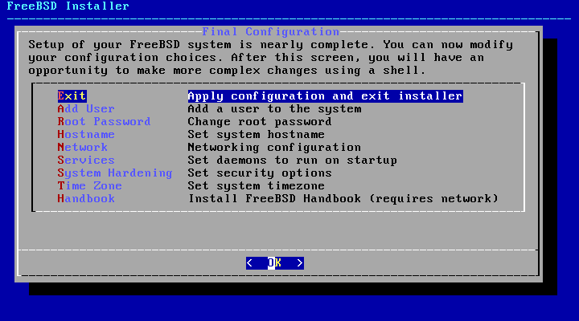

## FreeBSD -> Resumo geral
### Aquele manual básico para firmar estudos

&nbsp;

___
&nbsp;


### Introdução

Manual simples e resumido sobre o FreeBSD feita com base na documentação do FreeBSD, dispónivel neste endereço: https://docs.freebsd.org/en/books/handbook/, forá demais pesquisas feitas com o intuito de melhorar este documento.

&nbsp;

___

&nbsp;

### P.S

Qualquer contribuição ao manual é bem vinda, se conter erros e demais coisas, fique a vontade para mexer, isso ajuda a comunidade como um todo.

&nbsp;

___

&nbsp;

### Curiosidades interessantes 

* Totalmente free -> Licença BSD -> Sua licença é totalmente aberta, isso é, pode usar para qualquer coisa e pode ser trancado caso aquele que fez o fork queira.
* A primeira versão do FreeBSD foi a 1.0 em 1993, depois de problemas de código com a Novell, em 1994, grande parte do código interno foi alterado para de própria autoria do projeto, levando a versão 2.0 que possuia a versão Lite por não estar completo até data de lançamento.
* A equipe do BSD além de fechar a distribuição do BSD com uma fabricante de Discos CD em 1993, recebeu a oportunidade de possuir um computador com internet para a disponibilização do projeto.
* Possibilita o porte para o sistema ARM, exemplo o raspberry.
* O FreeBSD vem com o usuário ```root``` sem senha, já configurado no sistema, mesmo em modo live.

&nbsp;

___

&nbsp;

### Hardware

* Compátivel com processadores AMD64, X86 e ARM;
* Necessidade de mémória vária do uso do equipamento com a distro, porém é recomendo o minimo de 96MB de memória (pessoalmente, 1GB de memória é o suficiente para testes);
* Espaço de armazenamento mínimo é 2GB interno;

&nbsp;

___

&nbsp;

### Tipos de instaladores

* Installer Images -> Imagens de instaldores do FreeBSD.
* Virtual Machine Images -> Imagens prontas para máquinas virtuais.
* SD Card Images -> Imagens para cartão SD, possívelmente estruturas ARM em maioria.

&nbsp;

___

&nbsp;

### Dicas para criar uma mídia de boot 
###### P.S: Totalmente pessoal esse ponto

&nbsp;

Particularmente utilizo o Etcher Balena e o Rufus, ambos me atendendo super bem, para o caso de já estar utilizando alguma distro Linux, é possível usar o comando ```dd``` para gerar o disco bootavel externo ou mesmo o Etcher, se está utilizando o Windows, recomendo o uso do Rufus, segue abaixo os Links para o download dos arquivos e do sistema operacional:

* Rufus: https://rufus.ie/pt_BR/
* Etcher: https://www.balena.io/etcher/
* FreeBSD: https://www.freebsd.org/where/

Exemplo fornecido pelo próprio site do FreeBSD Documentation do uso do DD:

```
dd if=Image-FreeBSD-*.img of=/dev/da0 bs=1M conv=sync
```

###### P.S: Recomendo que esteja ciente dos trechos acima antes de realizar a criação (Para não perder tempo) da mídia, forá que se for instalar em alguma máquina, lembre-se de realizar o BK na mesma caso necessário.

&nbsp;

___

&nbsp;

### Sistemas de arquivos compátiveis

* MBR (Master boot record) -> 4 partições primárias máximas, porém pode se converter em partições lógicas, somente necessitando de uma partição primária para o sistema;
* GPT (GUID Partition Table / Tabela de partição GUID) -> Possui até 128 partições, eliminando a necessidade de partições lógicas como a MBR

&nbsp;

___

&nbsp;

### BIOS

Bom lembrar que existem dois tipos de BIOS utilizadas atualmente, a legancy e a UEFI, sendo a primeira a mais antiga e genérica e a segunda uma versão bolatada entre da Microsoft e a Intel que se espalhou para demais fabricantes e hardwares.

&nbsp;

___

&nbsp;

### Entrando no BSD

&nbsp;
___

&nbsp;


### Boot BSD

Iniciando a instalação do FreeBSD.


<center><small>Tela de boot de BSD, tanto para a instalação quando pós a instalação.</small></center>

&nbsp;

Quando carregada essa tela, ele tem um contador embaixo da tela, para parar esse contador é só pressionar qualquer tecla que não acione alguma função listada.

&nbsp;

Menu de boot:
* ```Multi user``` -> Iniciar sistema com capacidade de multiplos usuários;
    * Aperte ```1, B ou Enter```  para entrar neste modo;
    * Vale comentar que quando essa opção é escolhida, será feito o Boot do S.O já existente ou entra na tela de instalação;
        * Se quebrar o instalador, você entra em modo live, para quebrar o básico ```Ctrl+C```;
* ```Single``` ->  Modo de entrada de prompt para a recuperação do sistema, pelo menos segundo a página do BSD;
    * Aperte ```1 ou b``` para iniciar esse modo;
* ```Escape``` -> Abre um prompt limitado com somente alguns comandos, utilizado para reparo dentro do sistema;
    * Aperte ```3 ou Esc``` para entrar no modo;
* ```Reboot``` -> Reiniciar o sistema; 
* ```Cons``` -> Altera a constante do vídeo -> Tenho que entender melhor esse ainda;

&nbsp;


&nbsp;

Menu de opções:
* ```Kernel``` -> Seleciona o kernel (nucleo) do sistema que será utilizado no boot do S.O (Sistema operacional);
* ```Boot Options``` -> Opções de boot, para acionar as ações neste menu é só clicar nos valores que a opção faz referência ou na tecla onde a letra está BOLD:
    * 1 -> Para retornar ao menu principal é só teclar o ```1 ou backspace```;
    * 2 -> Recarregue as opções padrões do sistema, aperte ```2 ou d```; 
    * 3 -> ACPI: Se o sistema travar, altere essa opção, é para a gestão de energia do sistema sobre o hardware, aperte ```3 ou A```;
    * 4 -> Safe mode: Se o sistema persistir em travar, mesmo com o ACPI off, coloque este em ```ON``` (Não há muitos detalhes no handbook);
    * 5 -> Single user: Limita a quantidade de usuários a um uúnico para o boot  
    * 6 -> Verbose só libera um maior detalhamento dos command-lines na ação do sistema, aperte o ```6 ou v```;

&nbsp;

___

&nbsp;

### Install BSD

&nbsp;


<center><small>Menu de instalação caso não tenha um BSD já firmado na máquina ou queria instalar um.</small></center>

&nbsp;

Quando usado o instalador do FreeBSD, ele te dá 3 opções, sendo essas:

* ```Install``` ->  Inicia o processo de instalação;
* ```Shell``` -> Abre um Shell para manipular o computador ou fazer operações pré-instalação;
* ```Live CD``` -> Aqui é o famoso modo live, onde você pode usar o sistema de forma experimental, já que o mesmo só está em memória;

&nbsp;

Uma dica do site do handbook BSD é apertar ```s``` nessa tela para abrir um prompt e dar o comando ```more /var/run/dmesg.boot``` para verificar o boot e o hardware detectado.

&nbsp;

___

&nbsp;

### Esc and Ctrl+C in install

&nbsp;


<center><small>Olha um Esc ou Ctrl+C em ação.</small></center>

&nbsp;

Use o usuário ```root``` para entrar no modo live, vale comentar tambem que "ás vezes" ele pede a senha, nesse caso é só dar outro ```Esc ou Ctrl+C``` e tentar entrar denovo como ```root```, possivelmente irá funcionar, já que forá feitos testes.


&nbsp;

___

&nbsp;

### Agora é o install mesmo

&nbsp;

O menu de instalação da distro freeBSD é chamado de bsdinstall, a primeira parte da instalação é a detecção do tipo de teclado utilizado, Ex:


<center><small>Seleção de teclado.</small></center>

&nbsp;

Aqui você seleciona o teclado para o sistema, neste caso, após a seleção, ele te leva ao ```test keymap``` para confirmar que o teclado está correto.

&nbsp;

###### P.S: Selecione o ```Brazilian (withoud accent keys)``` pois funcionou maioria do meu teclado... bem, depois que ler mais um pouco, mais prafrente eu faço funcionar o ```Alt GR + Q``` para gerar o ```\```.

&nbsp;

Bem, depois de escolher e testar o teclado, caso tenha selecionado o ```default```, será o ``` americado ISO-8859-1```, será a tela de configuração do **hostname**, ai você pode colocar o nome que quiser para identificação do host na sua rede, Ex:


<center><small>Olha o hostname selecionado... eu sei, nada criativo, más bem, são testes mesmo, então tanto faz.</small></center>

&nbsp;

Agora a coisa fica mais interessante, pois nessa tela temos as opções de instações de pacotes opcionais para o sistema.


<center><small>Escolha sabiamente</small></center>

&nbsp;

Os pacotes listaos são:
* ```base``` -> Ferramentas básicas de sistema como ```CAT, LS, DIR``` e demais;
* ```Kernel``` -> Kernel e módulos com símbolos de depuração ativados;
* ```Lib32-dpg``` -> Bibliotecas para funcionamento de aplicativos 32bits em sistema 64 com símbolos de depuração ativados;
* ```Lib32``` -> O mesmo que o acima, porém sem a parte de símbolos;
* ```Ports``` -> Coleção de Ports BSD para automatizar download, compilação e instalação de pacotes terceiros, só lembrando que o Ports não verifica espaço em disco durante a instalação, isso é, o mesmo ocupa 500Mb a mais durante a instalação, lembre-se disso caso selecionar essa opção e do seu armazenamento.
* ```src``` -> Código-fonte do BSD para o Kernel e usuário, utilizado por alguns Ports e para o próprio desenvolvimento do BSD, lembrando, ele é utilizado para desenvolvimento e requer 1GB em armazenamento, forá mais 5GB para a recompilação de todo o S.O BSD; 
* ```test``` -> pacotes de teste do BSD;

&nbsp;

Bem, após a seleção dos pacotes, você precisa fazer o download deles para instalar caso tenha optado por manter atualizado ou se você pegou uma versão CD de boot, de qualquer forma será apresentada essa tela.


<center><small>Olha o aviso de instalação de pacotes via rede.</small></center>

&nbsp;

Ao que se segue agora, é a preferência de rede do BSD para a instalação de pacotes via rede, segue abaixo a configuração da placa de rede para o download dos pacotes.

&nbsp;

Há, existe uma parte do handbook sobre configuração da rede do BSD, porém, durante esse manual, BSD foi instalado em um virtualbox e está usando uma placa de rede NAT, então deixei a config mais simples... 

&nbsp;

##### P.S: volto a melhorar essa parte depois com mais testes.

&nbsp;


<center><small>Selecionar placa de rede.</small></center>
&nbsp;


<center><small>Decido ou não aceitar o uso do IPV4, esse eu marquei que sim.</small></center>
&nbsp;


<center><small>Aqui eu falo que se quero ele estático ou DHCP... Fui no DHCP para economizar tempo.</small></center>
&nbsp;


<center><small>Decido ou não aceitar o uso do IPV6, esse eu marquei que não.</small></center>
&nbsp;


<center><small>Configuro o DNS que o host vai usar.</small></center>
&nbsp;


<center><small>Aqui é de onde ele vai baixar os pacotes.</small></center>
&nbsp;

Ufa.... com isso é o fim da configuração do download dos pacotes, há, lembrando, isso aqui é mais para quem quer deixar os pacotes atualizados ou baixou uma versão mais "lite" do FreeBSD por assim dizer.

&nbsp;

Ai, agora é hora de rolo, hora de otimizar ou só taca no automatico e vai.


<center><small>Aqui é de onde ele vai baixar os pacotes.</small></center>
&nbsp;

Aqui é a configuração de forma de instalação do BSD no armazenamento interno, segue abaixo os tipos de instalação:

* ```Auto``` -> Aqui é a formatação automático via ```UFS``` do sistema de arquivos;
* ```Manual``` -> Aqui é a criação manual das partições para a instalação do S.O;
* ```Shell``` -> Esse abre um Shell para a criação de partições utilizando as ferramentas de sistema, Ex: ```Gpart, Fdisk, BsdLabel``` e outros;
* ```Auto``` -> (ZFS)O particionamento cria um sistema root-on-ZFS com suporte de criptografia GELI opcional para ambientes de inicialização... ***(Esse aqui eu não entendo bem... tenho que dar uma olhada mais fundo)***; 

&nbsp;

___
***Aqui sinceramento eu pulei os demais métodos e fui direto para o modelo Auto de instalação, neste eu selecionei o sistema de arquivos MRB... bem, eu volto mais tarde para tentar realizar a instalação nestes modelos.***
___


&nbsp;

Abaixo segue a instalação dos pacotes opcionais e do sistema.


###### P.S: Antes de continuar, deixo avisado para eu não ser julgado, somente é por convivencia com discos HD..., Não tenho contato, nem mesmo conheco alguém do ramo, más não importa para quem tu reza ou se nem reza, tenha um SSD no seu hardware para ganhar tempo de vida.

&nbsp;


<center><small>Aqui é o download dos pacotes externos que foram selecionados no opcionais.</small></center>

&nbsp;

Primeiramente... Depois de você ter criado a partição, agora elas seram utilizadas primeiramente para a criação do sistema de arquivos, em seguida o download dos pacotes opcionais, sendo que, se a instalação for do tipo DVD, todos os opcionais já vão estar dentro do disco, se não, exemplos os ```bootonly media, CD, mini memstick e demais```, ele precisa fazer o download dos pacotes, por isso a seleção do Mirror antecipadamente foi útil.... OK, em resumo sobre isso, ele confere a lista selecionada, baixa os pacotes opcionais, confere se os mesmos não estam corrompidos e seguidamente os passa ao instalador do sistema.

&nbsp;


<center><small>Aqui é a instalação dos pacotes do sistema em si.</small></center>

&nbsp;

Como dito, os pacotes opcionais são obtidos e deixados para serem instalados por esse processo de extração.

###### P.S: Como comentando no handbook, o tempo de instalação vária muito, quantidade de pacotes, velocidade de internet se você precisar dela para baixar pacotes, o hardware em si, como quantidade de memória, CPU e principalmente o armazenamento

&nbsp;

Bem, bem, depois do processo de extração, será requisitada a criação de senha para o literal usuário mais importante do sistema, o ```root```, neste caso, peço só que lembre da senha... sério, se não depois passa um apertado para pegar a senha devolta ou descobrir a mesma.

&nbsp;


<center><small>Aqui você seleciona o time-zone do sistema, no caso, aqui foi de américas, Brasil e agora a seleção do estado.</small></center>

&nbsp;

Depois de selecionar o time-zone, vem uma tela para configurar os horários locais... ai vai de você no caso, só acertar o relógio ou selecionar o ```skip```.

###### P.S: Recomendo configurar corretamente o horário para não ter problemas a acesso de pacotes externos.

&nbsp;


<center><small>Esses são os serviços default da instalação do BSD... aqui tem que escolher oque será iniciado junto ao sistema.</small></center>

&nbsp;

Depois de tudo isso, vem agora você tem que selecionar os serviços que serão iniciados durante o boot, todos esses serviços são opcionais, não necessários para o funcionamento do sistema, esse é outro ponto para deixar no automático ou personalizar, ai vai da necessidade de cada um.

&nbsp;

Más bem, segue abaixo um pouco de detalhamento dos serviços:

* ```local``` -> Ative o serviço de DNS local, vale comentar que esse é somente para o host e não valido a toda a rede, caso seja esse o seu objetivo, é recomendado instalar o resolvedor DNS, no caso, esse: ```dns/unbound```.
* ```sshd``` -> Habilita o SSH (daemon Secure Shell), que possibilita um acesso remoto criptografado ao host.
* ```moused``` -> Serviço de mouse para o console do sistema;
* ```ntpdate``` -> Habilite um serviço de NTP para sincronizar o relógio do host durante o boot.
* ```ntpd``` -> Habilita o NTP para buscar de servidores do mesmo para a sincronização do relógio do host;
* ```powerd``` -> Serviço para controle de energia do hardware caso o mesmo permita ou tenha esse controle, serve para ajustar frequência do CPU e demais outras peças;
* ```dumpdev``` -> Habilita os despejos de memória, isso é, limpar a memória de coisas que deram problemas e demais;

&nbsp;


<center><small>Esses são os serviços default da instalação do BSD... aqui tem que escolher oque será iniciado junto ao sistema.</small></center>

&nbsp;

Ok, depois de selecionar os serviços, ta na hora de escolher o sistema de segurança do BSD, que comecem os jogos:

* ```hide_uids``` -> Oculta UID de processos em execução para usuários sem permissão;
* ```hide_gids``` -> Oculta processos em execução pertencendos a outros grupos;
* ```hide_jail``` -> Oculta processos em execução nas ```jail's``` para usuários sem permissão;
* ```read_msgbuf``` -> Retira a permissão de leitura do buffer de mensagem do kernel para usuários sem privilégios, basicamente desativa o dmesg para alguns usuários e tira a permissão de leitura dos arquivos que contém essas infos;
* ```proc_debug``` -> Desabilitar possibilidade de depuração dos processo para usuários sem privilégios, basicamente quase todos os processo do sistema e demais linguagens ficam desabilitados o depurador para esse usuário;
* ```random_pid``` -> Randomize o PID de processos recém-criados.
* ```clear_tmp``` -> Limpa o diretorio ```/tmp``` quando o sistema da boot;
* ```disable_syslogd``` -> Desative a abertura do soquete da rede syslogd, claro, existe mais detalhes, porém tem que confirmar na configuração personalizada do BSD sobre o serviço;
* ```disable_sendmail``` -> Desative o agente de transporte de correio sendmail;
* ```secure_console``` -> Quando esta opção é ativada, o prompt solicita a senha de ```root``` para entrar no modo de usuário único.
* ```disable_ddtrace``` -> O DTrace pode ser executado de forma destrutiva para o kernel em execução, para mais detalhes, tem que conferir a funcionabilidade do programa e seus parâmetros.

&nbsp;

Ótimo, depois de todos esses passos, chegamos ao final, que é adicionar um usuário ao BSD sem ser o ```root```, para isso, selecione o ```yes``` na tela de adicionar mais um usuário ao sistema, se selecionar o ```no```, pronto, o sistema irá terminar o processo de instalação, aplicar as alterações e fechou, um BSD totalmente instalado.

Agora, esse é um usuário já criado no BSD, Ex:


<center><small>Esse usuário é bem default, sem qualquer customização, forá a senha.</small></center>

&nbsp;

As informações do usuário são:

* ```Username``` -> Nome do usuário, boas práticas para isso são:
    * Sem espaçamento;
    * Sem caracteres especiáis;
    * O sistema é case-sensitive, então o mesmo diferença de maiúsculo de minúsculo;
    * Todo nome de usuário deve ser único;
* ```Full name``` -> Nome completo do usuário, aqui é um campo de descrição, então pode digitar sem medo dos descritos acima;
* ```Uid``` -> ID do usuário e esse é normamente deixado por conta do sistema, a mesmo que você saiba quais ID's ainda estão disponíveis;
* ```Login group``` -> O grupo que o usuário irá pertencer e aqui também é normal deixar em branco, poiso grupo se torna o nome do usuário.
* ```Invite user into other groups?``` -> Grupos adicionais, isso é, grupos a qual o usuário pode pertencer, como grupos que tem permissões especiais e demais;
    * Se o usuário precisar de ```root```, digite: ```wheel``` neste campo;
* ```Login class``` -> Normalmente deixado em branco para o padrão ***(Sinceramente não sei nem oq é, tenho que ver isso depois)***;
* ```Shell```-> Seleciona qual shell o usuário utilizará por padrão;
* ```Home directory``` -> O diretório do ```\home``` do usuário, normalmente, o default já preenche corretamente;
* ```Home directory permissions``` -> Permissões no diretório ```\home``` do usuário.
* ```Use password-based authentication?``` -> Aqui pergunta se o usuário quer usar o password para entrar no usuário;
* ```Use an empty password?``` -> Aqui decide se o usuário vai usar uma senha ou se será um campo em branco, é melhor colocar uma, afinal, você não vai usar um BSD para acessar email do google né;
* ```Use a random password?``` -> Favor usar o ```no``` aqui, se gerar uma senha aleatória e você esquecer... bem, espero que saiba onde fica armazenado as senhas do sistema;
* ```Enter password``` -> Aqui você digita uma senha para o usuário;
* ```Enter password again``` -> Agora você repete aquela mesma senha aqui para efetivar a senha do usuário;
* ```Lock out the account after creation?``` -> Por default é um ````no```, pois ai o usuário fica trancado e não pode acessar;


&nbsp;

Agora, depois de tudo isso, é só dar um ```OK``` para finalizar a criação do usuário... Ufa, cabou , bem, nem tanto, depois que você terminar de criar o usuário aparecerá uma pergunta para adicionar um novo outro usuário ou não, nesse caso, ai vai de sua vontade ou necessidade.

&nbsp;

Por fim, agora que foi feito tudo o de neessário, aparecerá essa tela:


<center><small>Tela para efetivar tudo e sair, ou alterar alguma coisa antes de aplicar.</small></center>

&nbsp;

Como dito na descrição da imagem, aqui é possível alterar as configurações antes de aplicar e finalizar totalmente a instalação do sistema.

Com isso está terminado a parte da instalação do sistema BSD, para finalizar, aperte a opção do ```EXIT``` e pronto... más e os demais? ... Bem, eles já foram vistos de forma seguida, más para deixar de forma mais didática, eles são:

* ```Add User``` -> Adicionar usuários.
* ```Root Password``` -> Definição da senha do ```root```.
* ```Hostname``` -> Definir o nome do host.
* ```Network``` -> Configurações da's interface's de Rede .
* ```Services``` -> Ativação de serviços .
* ```System Hardening``` -> Opções de segurança de proteção .
* ```Time Zone```-> Definição do fuso horário .
* ```Handbook``` -> Baixe e instale o Manual do FreeBSD.

&nbsp;

___

&nbsp;

### Problemas durante a instalação

Segundo o pessoal do handbook e como comentado anteriormente, o BSD vem com o ACPI ligado, isso é, gerenciamento de energia inteligente ao hardware, porém tem BIOS ou Firmware's de placas mãe's que ainda são incompátiveis ou apresentão problemas, dessa forma é recomendado fazer:

* Desabilitar nas opçõe savançadas durante a instalação;
* Digitar em modo shell o comando: ```set hint.acpi.0.disabled="1"``` para desabilitar a opção;
* Ou por fim, alterar o arquivo ```/boot/loader.conf``` adicionando a linha ```hint.acpi.0.disabled="1"``` ao mesmo e recarregando o arquivo no sistema de instalação;

&nbsp;

___

&nbsp;

### Primeiro login

&nbsp;

```
FreeBSD/amd64 (teste_freebsd) (ttyv0)

login:
```

&nbsp;

Depois de toda a tela de verbose após iniciar o sistema que é exatamente igual a tela de bootinstall, o sistema para na tela de login entrando as informações de:

* Versão: amd64;
* Hostname: teste_freebsd;
* Console virtual: ttyv0;

&nbsp;


O login é a entrada de usuários que foram registrados durante a instalação, com exemplos desses podemos logar no ```root``` e no ```teste``` criados durante a instalação da versão em uso.

Após o login, uma mensagem será printada no terminal console, sendo essa o ```MOTD```, que entrada várias informações, Ex:


<center><small>MOTD BSD após o login no usuário root.</small></center>

Para editar esse ```MODT```, é necessário ter as permissões necessárias para editar o arquivo que fica no ```/etc/motd```.

&nbsp;

___

&nbsp;

### Consoles virtuais

&nbsp;

Isso é algo comum, normalmente só utilizamos um único terminal por ver, isso é, um único console por ver, cada console é nomeado de ```ttyv*```, indo de 0 a 8, podendo ser alterado com o uso dos comandos ```Alt+F*``` de 1 a 8.

&nbsp;

O local onde fica as configurações de consoles virtuais é no ```/etc/ttys```, aproveitando, é bom orientar que:

* Não comente a linha ```ttyv0```, afinal é o default;
* O ```ttyv8``` é normalmente utilizado pelos programas que geram interfaces gráficas, no caso o Xorg.


Veja a imagem abaixo para você ter uma idéia da configuração dos consoles virtuais.

&nbsp;


<center><small>Configuração dos TTYSV do BSD.</small></center>

&nbsp;

___

&nbsp;

### Boot single user

&nbsp;

Lembra que foi comentado sobre o boot de usuário unico era para reparar o sistema operacional, sabe, lá no inicio.... bem, é isso mesmo, más olha a sacada, dentro desse modo, o unico usuário disponivel é o ```root``` e sem senha... sentiu o medo né, tipo e um acesso remoto... sem senha com o usuário com maior permissão dentro do sistema... vai dar ruim né!? Nops, olha o pq.

Esse modo abre o terminal com o usuário ```root``` sem senha, porém bloqueia acesso externo a rede, necessitando de interação física ao equipamento para o exercicio da tarefa, sendo assim, você pode manipular o sistema totalmente, porém tem que ter acesso ao mesmo, forá que esse modo além de ser usado para reparação, é usado também para redefinir a senha do ```root``` caso a mesmo tenha sido perdida.

Para ficar ciente, quando você faz um boot de single user, os ttyv são a base para o acesso, seguindo a mesma regra, onde o default é o ```ttyv0```, o fato de você acessar o mesmo sem precisar da senha é porque ele está com o ```secure``` afirmado no fim da linha, isso é, se estiver ```insecure```, mesmo em modo single user, será necessário colocar a senha do usuário ```root``` para ter acesso e isso leva o perigo que, se você esta entrando nesse modo para recuperar a senha de root perdido... bem, vai dar não, entao sempre tenha cuidado e zelo pelas senhas utilizadas nos sistemas e aplicações.

&nbsp;

___

&nbsp;

### Configuração de vídeo


&nbsp;

___

&nbsp;

### Contas e usuários

Primeiramente, existem que tipos de contas dentro do sistema BSD? Segue abaixo uma lista dos tipos:

* ```daemon```;
* ```operator```;
* ```bind```;
* ```news```;
* ```www```;
* ```nobody```;

Forá demais outras, os litados são um exemplo, cada tipo de conta tem um limite de agir dentro do sistema, sendo assim, cada um tem um nível de prioridade, vamos supor que o ```nobody``` é o tipo predominante dentro do sistema e esse grupo for comprometido de alguma forma, bem, isso vai gerar uma grande perda, já que todos os arquivo deste mesmo tipo estão igualmente comprometidos.

Vale tambem comentar que a ```nobody``` é a conta genérica do sistema e que não possiu privilégios.

&nbsp;

___


&nbsp;

### Usuário típico

&nbsp;

Cada conta dentro de um S.O tem suas caracteristicas, sendo assim, o mesmo vale para o BSD, segue abaixo as caracteristicas de um usuário do sistema:

&nbsp;

* ```Nome do usuário``` -> Nome único de acesso a uma conta dentro do S.O, existem muitas padronizações deste, sendo essas:
    * Usuário em letras maiusculas;
    * Primeira letra do primeiro nome e usar o segundo nome para completar o restante dos caracteres;
    * Limitar a quantidade de caracteres a 8;
    * Além de outras demais...
* ```Senha``` -> Aqui é só colocar uma senha para proteger seu usuário;
* ```ID (UID)``` -> Número único de identificação do usuário;
    * Recomendado usar um ```UID``` menor que ```65535``` para não haver conflitos com softwares;
* ```GID``` -> ID do grupo, o BSD usa esse método em vez do ```UID``` para diminuir significativamente o tamanho dos arquivos de configuração das aplicações;
    * Recomendado usar um ```GID``` menor que ```65535``` para não haver conflitos com softwares;
    * Usuários podem pertencer a mais de um grupo, isso é, o grupo que libera acessos as aplicações, assim se um usuário pertencer a determinado grupo, ele terá direito de usar as mesmas aplicações;

&nbsp;

Como comentado dentro do handbook, os usuários BSD não tem tempo de expiração, isso é, sua vida útil é ilimitada, necessitando de um utilitário para dar fim a mesma ou alguma configuração personalizada que realize a ação.

&nbsp;

___

&nbsp;

### Cuidados com o ROOT!!!!

&nbsp;

Acho que já deu para entender que o ```root``` é literalmente o cara que manda em tudo no S.O... sim, ele é o usuário com acesso irestrito a todo o S.O, por isso deve ser protegido a 7 chaves e não deve ser usado de forma leviana, isso é, não trabalhe como ```root``` se não for necessário.

&nbsp;

Para que você fique ciente, uma forma fácil de saber se você tá em ```root``` é:

&nbsp;

* Diferenças visuais do shell como:
    * \# -> Usuário root tem esse símbolo no shell;
    * $ -> Usuário comum tem esse símbolo no shell;
    * O usuário é sempre mostrado no shell na command line, Ex: ```teste@hostname:diretorio$```
* Por comandos, pode se usar o:
    * ```whoami``` -> Utilitário que fala qual é o usuário em uso no momento;
    * ```cd ~``` + ```pwd``` -> Isso é, o ```cd``` vai mandar seu command line para o diretório do usuário atual e ```pwd``` é um utilitário que mostra em qual diretório você está no sistema, no caso, o diretório do seu usuário;

&nbsp;

Vale comentar que o usuário pode se tornar ```root``` utilizando o comando ```su```, más para isso, existem duas etapas, sendo essas:

&nbsp;

* O usuário que vai receber permissão ```root``` tem que estar no grupo ```wheel``` como já comentado uma vez;
* Saber a senha do usuário ```root``` para obter seus privilégios;

&nbsp;

Um exemplo de como liberar acesso ao ```root``` a um usuário comum, lembrando que isso será comentando com mais detalhes a frente:

&nbsp;


<center><small>Adicionando o wheel a um usuário comum.</small></center>

&nbsp;


<center><small>Se tornando root via usuário comum que está no grupo wheel.</small></center>

&nbsp;

Há, o ```su -``` é só entrar no usuário com maior permissão e no caso, com o ```-```, é entrar já na estrutura de diretório do usuário alvo.

&nbsp;

___

&nbsp;

### Gerenciamento de usuários

&nbsp;

Sabe o mais pra frente que eu falei... bem, é agora, sendo essas as ferramentas para gerenciamento dos usuários do sistema:

* ```adduser``` -> Adicionar usuários;
* ```rmuser``` -> Deletar usuários;
* ```chpass``` -> Alterar informações do usuário;
* ```passwd``` -> Alterar a senhas dos usuários;
* ```pw``` -> Utilitário para modificar totalmente o usuário;

&nbsp;

#### ***ADDUSER***

A ferramenta é utilizada e recomenda para adicionar novos usuários dentro do sistema, para fazer isso, primeiramente você precisa de acesso de superusuário, o ```root``` para ser mais especifico ou qualquer usuário com igual poder..., más certo, oqê acontece quando vamos adicionar um novo usuário? Isso aqui:

&nbsp;

* É criado um diretório no ```/home``` que irá pertencer ao novo usuário;
* É atualizado o ```/etc/passwd``` para o novo usuário;
* É atualizado e alterado os grupos no arquivo ```/etc/group```;
* O diretório do novo usuário irá receber as configurações padrão que vem do ```/usr/share/skel```;

&nbsp;

É valido comentar que, a tela do ```adduser``` é exatamente a mesma de quando criado um usuário no install do BSD.

Se não acredita em mim, veja o ```adduser pastel``` abaixo:

&nbsp;


<center><small>Fiquei com fome nas print...</small></center>

&nbsp;

###### P.S: Acho que se já notou, más quando é digitado senhas, para entrar, criar ou modificar alguma coisa ou mesmo o usuário, ela não aparece na tela... então, cuidado com isso quando criar o usuário, se você tiver o root, até se salva, más mesmo assim, é um transtorno a mais.

&nbsp;

Há, por fim... pra você que ficou pensando "E se eu adicionar um usuário com um nome que já existe, afinal, o que conta de verdade é o UID e o GID né?"... Bem, não é assim támbem, como vai de exemplo na imagem abaixo, o nome influencia na criação do diretorio e demais, más foi mais por curiosidade mesmo, afinal o handbook não comentou sobre esse ponto ***(Mesmo que pareça óbvio que iria dar errado)***.

&nbsp;


<center><small>Erro ao adicionar novos usuários.</small></center>

&nbsp;

___

&nbsp;

#### ***RMUSER***


&nbsp;

Já falamos sobre adicionar, agora vamos ao deletar, lembrando que para você criar, eliminar ou qualquer coisa, você precisa ter as permissões necessárias, isso é, vai fazer em ```root``` ou qualquer usuário com poderes iguais, más bem, segue abaixo as ações do ```rmuser```:

* Remove as configurações de crontab do usuário -> Caso existir;
* Finaliza todos os ```jobs``` em execução do usuário;
* Mata todos os processos do usuário;
* Remove as configurações do ```/var/mail``` do usuário;
* Elimina todos os arquivos no ```/tmp``` pertencentes ao determinado usuário;
* Elimina o usuário dos grupos a quais ele pertence, isso no arquivo ```/etc/group```.
* Se um grupo não tiver nenhum usuário e ele tiver o mesmo nome do usuário, o grupo é eliminado;
* O diretório no ```/home``` do usuário não é eliminado sumáriamente, ele precisa ser requisitado no momento do rm;

&nbsp;

Bem, como eu fiquei com fome depois do usuário pastel, melhor eliminar ele, só pra eu esquecer do pastel e me concentrar aqui.

&nbsp;


<center><small>Lá se foi o pastel.... ainda com fome.</small></center>

&nbsp;

Ok, chega de piadas neste ponto, na imagem, foi expresso meu desejo por eliminar o usuário e eliminar o diretório no ```/home``` deste usuário, com isso, o usuário está totalmente eliminado do sistema, as únicas provas do mesmo serão arquivos pertencentes a ele forá do ```/home``` ou logs por exemplo.


&nbsp;

___

&nbsp;

#### ***CHPASS***

&nbsp;

Esse é um utilitário que pode ser utilizado pelo próprio usuário sem a permissão ```root``` ou qualquer superusuário, a função deste comando é alterar a base de dados do determinado usuário alvo, podendo ser feita de duas formas:

&nbsp;

* ```chpass``` -> Isso vai abrir um editor num arquivo contendo informações do usuário atual;
* ```chpass <usuario>``` -> Isso vai abrir um editor num arquivo contendo informações do usuário alvo e esse precisa do superusuário, afinal, você está alterando informações de um terceiro;

&nbsp;

Más de forma mais simples de se entender, o ```chpass``` abre um editor de texto para você alterar o banco de dados do usuário de forma que o mesmo fique correto ou que algo sejá alterado, lembrando que há a necessidade de recarregar essas informações.

&nbsp;


<center><small>Lá se foi o pastel.... ainda com fome.</small></center>

&nbsp;

___

&nbsp;

#### ***PASSWD***

&nbsp;

Comemorei cedo demais e aparece outro que não precisa de superusuário para ser acionado, neste caso, o ```passwd``` é para alterar o campo da senha do usuário atual ou alvo, sabe aquele campo que se viu na imagem acima, o ```Password```, é exatamente isso que o ```passwd``` vai mexer, além de o mesmo já deixar a senha já cifrada.

&nbsp;

Assim como o ```chpass```, o ```passwd``` tem duas formas de funcionar, a primeira é pelo próprio usuário, onde o sistema requisita a senha antiga para alterar há uma nova e a segunda é utilizando o comando e direcionando a um determinado usuário, onde lá, não será requisitado a senha antiga e sim, somente colocar a nova e finalizar o problema, segue imagens sobre as ocorrências abaixo:

&nbsp;


<center><small>Aqui foi feito pelo próprio usuário, onde é necessário digitar a senha antiga para conseguir alterar para uma nova.</small></center>

&nbsp;


<center><small>Aqui foi feito pelo próprio superusuário, onde ele simplesmente falou, coloque a nova senha, sem a necessidade da senha antiga já existente ao usuário.</small></center>


&nbsp;

###### P.S: É com esse comando que você concerta o problema sobre usar senha randomica no usuário, esquecer a senha de demais usuários ou alterar... lembrando, nunca esqueça a senha do root, senão é entrar em modo recuperação e ir ajustar como usuário único e torcer para a sessão ser segura. 


&nbsp;

___

&nbsp;

### Gerenciador de grupos via PW

&nbsp;

Um grupo é o conjunto de um ou mais integrantes que podem realizar determinada tarefa com base na permissão desse grupo, esses grupos ficam listados no arquivo ```/etc/group``` do BSD.

&nbsp;

Se o usuário tem o ```UID```,  o grupo tem o ```GID```, que consiste do nome e identificação, para a realização de processos do sistema, se é usado tanto o ```UID``` para saber quem está realizando tal coisa e o ```GID```, que confirma se um usuário pode realizar a determinada ação corretamente.

&nbsp;

Exemplos de uso do ```PW``` na realidade:

&nbsp;


<center><small>Aqui um grupo é criado, mostrado suas informações gerais e um usuário já é integrado neste grupo.</small></center>

&nbsp;

O uso da opção ```-M``` é para substituir membros já existentes ou adicionar membros a grupos vazios, isso é, se esse cara for usado, todos os antigos usuários que pertenciam a este grupo seram retirados e somente será colocado o novo usuário, Ex:

&nbsp;


<center><small>Olha o exemplo prático de um erro que pode f***** seu dia.</small></center>

&nbsp;

Agora vai o exemplo do ```-m```, que em vez de substituir, ele adiciona usuários ao grupo, Ex:

&nbsp;


<center><small>Agora é só um incremento, menos pior se for ver... bem, depende do problema.</small></center>

&nbsp;

Há, lembrando, quando utilizado a ferramenta ```pw```, somente é alterado o arquivo do ```/etc/groups```, o arquivo ```/etc/passwd``` fica intocado.

&nbsp;

___


&nbsp;

### Permissões

&nbsp;


&nbsp;

___

&nbsp;

### Estrutura de Diretório

&nbsp;

Segue abaixo uma tabela com o esquema de diretórios do sistema FreeBSD, lembrando que o diretório principal é a raiz do sistema, o ```/```.

&nbsp;

| Diretório | Descrição | 
|---|---|
|/| Raiz do sistema|
|/bin|Utilitários fundamentais para usuário único ou multiusuário|
|/boot|Programas e configurações utilizadas para o boot do sistema|
|/boot/defaults|Arquivos de configuração de inicialização padrão.|
|/dev|Conexões com dispositivos de hardware, como impressoras e discos, além de demais outros.|
|/etc|Arquivos e scripts de configuração do sistema.|
|/etc/defaults|Configuração padrão do sistema S.O.|
|/etc/mail|Configuração para softwares de email.|
|/etc/periodic|Scrips que serão executados pela crontab.|
|/etc/ppp|Arquivos de configuração do protocolo de ponto a ponto ```(PPP)```.|
|/mnt|Diretório vazio com utilidade de ser utilizado para montagem de unidades externas, em rede ou demais.|
|/proc|Sistema de arquivos de processo.|
|/rescue|Softwares para recuperação do sistema.|
|/root|Diretório da conta ```root```.|
|/sbin|Programas e utilitários fundamentais para o funcionamento do sistema.|
|/tmp|Arquivos temporários que geralmente não são preservados durante a reinicialização do sistema pois é montado durante tempo de execução, então fica em memória.|
|/usr|A maioria dos utilitários e aplicativos do usuário.|
|/usr/bin|Utilitários, ferramentas de programação e aplicativos comuns.|
|/usr/include|O padrão C de arquivos incluidos.|
|/usr/lib|Biblioteca dos arquivos em geral.|
|/usr/libdata|Arquivos de dados de utilitários diversos.|
|/usr/libexec|Daemons do sistema e utilitários do sistema executados por outros programas.|
|/usr/local|Executáveis ​​e bibliotecas locais, que também é usado como destino padrão para o framework de ports, dentro do próprio do / usr / local , o layout geral esboçado por hier (7) para / usr deve ser usado. As exceções são o diretório man, que está diretamente em / usr / local em vez de em / usr / local / share , e a documentação do ports está em share / doc / port .|
|/usr/obj|Diretório produzido pela construção do diretório /usr/src|
|/usr/ports|Coleção de ports do FreeBSD|
|/usr/sbin|Daemons do sistema e utilitarios executados pelo usuário|
|/usr/share|Arquivos independentes de arquitetura|
|/usr/src|BSD e/ou arquivos de origem local|
|/var|Arquivos diversos e de multiuso, como logs, spool, valores fixos do sistema e demais, esse diretório só existe em tempo de execção, já que é montado em memória|
|/var/log|Arquivos de log diversos|
|/var/mail|Caixa de correio|
|/var/spool|Arquivos de spool|
|/var/tmp|Arquivos temporários que são preservados após a reinicialização do S.O|
|/var/yp|Mapas NIS ***(Conferir melhor esse ponto depois)***|

&nbsp;

Segue um exemplo da raiz do FreeBSD, lembrando que essa foi uma instalação ```default``` e sem qualquer alterações:

&nbsp;


<center><small>Toda a raiz simples de um BSD sem customizações.</small></center>

&nbsp;

Fica abaixo um exemplo do uso do local do ```/usr/local``` após qualquer instalação de um programa externo ao que já forá adicionado durante a instalação.

&nbsp;


<center><small>Demonstração de um /usr/local com a instação de somente o componente htop dentro do S.O.</small></center>

&nbsp;

___

&nbsp;

### Comando SU

&nbsp;


<center><small>Exemplo da troca de usuário em tempo real via comando su no shell SH BSD.</small></center>

&nbsp;

___

&nbsp;

### Shutdown

&nbsp;

Para o desligamento do sistema BSD, é feito os seguintes passos:

&nbsp;

* Comandos de desligar ou reiniciar o sistema requisitarão o shell ```/etc/rc.shutdown```;
* Após acionar o shell, todos os processos receberam um sinal de ```TERM```, aqueles que não responderem em tempo hábil, receberam um ```KILL```;

&nbsp;

Para o desligamento do sistema em arquiteturas que suportam o controle de ACPI, é necessário os comandos:

```
shutdown -p now
init 0
halt -p
```

&nbsp;

Para reiniciar o sistema use:

```
shutdown -h now
reboot
halt -q
```

&nbsp;

Lembrando somente os membros do grupo ```operator``` ou o próprio ```root``` tem capacidad de reiniciar ou desligar.

&nbsp;

___

&nbsp;

### Compilar um PORT

&nbsp;

Para compilar uma porta, você simplesmente muda para o diretório do programa que deseja instalar, digite make installe deixe o sistema fazer o resto. 

&nbsp;

___

&nbsp;

### Agradecimentos

&nbsp;

Há, aqui vai coisa ainda para ser feita, más agradeço a própria documentação do BSD e todos os sites buscados durante o desenvolvimento deste mini-manual. 

&nbsp;
___